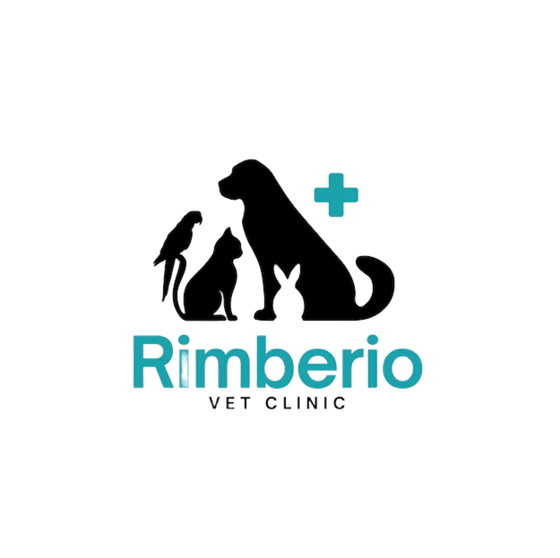

🐾 VetCare - Sistema de Gestión Veterinaria



Sistema web para la administración de clínicas veterinarias desarrollado con **Node.js, Express y MySQL** como proyecto académico para la asignatura **Programación y Servicios Web**.

---

## 👥 Equipo

| Integrante | Rol                            |
| ---------- | ------------------------------ |
| Brehiman   | Líder de proyecto / Full Stack |
| Juliana    | Desarrollo / Full Stack  |

---

## 🛠️ Tecnologías Utilizadas

### Frontend

* HTML5
* CSS3
* JavaScript (Vanilla)
* Fetch API

### Backend

* Node.js
* Express.js
* MySQL
* bcrypt
* express-session
* Multer

### Seguridad

* Helmet
* CORS
* dotenv
* Contraseñas cifradas

---

## 🚀 Funcionalidades

### 🔐 Autenticación

* Inicio y cierre de sesión
* Registro de usuarios
* Protección de rutas privadas
* Manejo de sesiones

### 📊 Dashboard

* Estadísticas generales
* Citas del día
* Últimos registros

### 👤 Gestión de Dueños

* Crear, consultar, editar y eliminar
* Búsqueda por nombre o teléfono

### 🐶 Gestión de Mascotas

* CRUD completo
* Asociación con dueños
* Búsquedas y filtros
* Carga de fotografías

### 📅 Gestión de Citas

* CRUD completo
* Asignación de veterinarios
* Control de estados
* Evidencias mediante imágenes

### 💊 Recetas Médicas

* Generación de recetas
* Selección de medicamentos
* Impresión de recetas

### 🩺 Veterinarios y Medicamentos

* Registro de veterinarios
* Especialidades
* Catálogo de medicamentos
* Control de stock

---

## 📁 Estructura General

```text
veterinaria
├── backend
│   ├── controllers
│   ├── routes
│   ├── middleware
│   ├── database
│   └── config
│
├── frontend
│   ├── css
│   ├── js
│   ├── img
│   └── uploads
│
├── package.json
└── README.md
```

> El proyecto sigue una arquitectura basada en controladores, rutas y módulos independientes para facilitar el mantenimiento y escalabilidad.

---

## ⚙️ Instalación

### 1. Clonar repositorio

```bash
git clone https://github.com/Brehiman/sistema-de-veterinaria.git
cd veterinaria
```

### 2. Instalar dependencias

```bash
npm install
```

### 3. Configurar base de datos

Ejecutar:

```sql
backend/database/schema.sql
```

en MySQL Workbench o phpMyAdmin.

### 4. Configurar variables de entorno

```env
DB_HOST=localhost
DB_USER=root
DB_PASSWORD=
DB_NAME=veterinaria
DB_PORT=3306

SESSION_SECRET=vetcare_secret_key
PORT=3000
```

### 5. Ejecutar aplicación

```bash
npm run dev
```

Acceder desde:

```text
http://localhost:3000/login.html
```

---

## 📡 Principales Endpoints

### Autenticación

```http
POST /api/auth/login
POST /api/auth/registro
GET  /api/auth/verificar
POST /api/auth/logout
```

### Dueños

```http
GET    /api/duenos
POST   /api/duenos
PUT    /api/duenos/:id
DELETE /api/duenos/:id
```

### Mascotas

```http
GET    /api/mascotas
POST   /api/mascotas
PUT    /api/mascotas/:id
DELETE /api/mascotas/:id
```

### Citas

```http
GET    /api/citas
GET    /api/citas/today
GET    /api/citas/upcoming
POST   /api/citas
```

### Otros módulos

```http
POST /api/recetas
POST /api/imagenes
```

---

## 🎨 Paleta de Colores

| Elemento   | Color   |
| ---------- | ------- |
| Principal  | #4CAF50 |
| Secundario | #2E7D32 |
| Fondo      | #FFFFFF |
| Bordes     | #E5E7EB |

---

## 📝 Licencia

Proyecto desarrollado con fines académicos para la asignatura **Programación y Servicios Web**.

---
